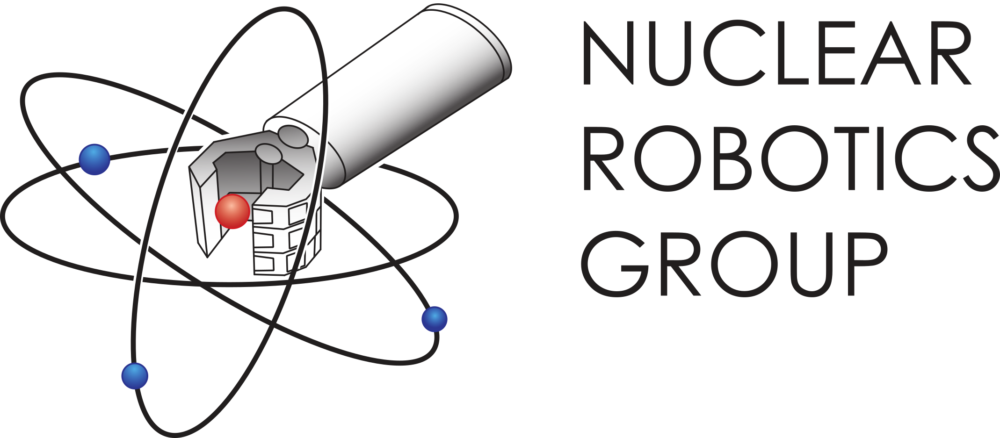

**TeMoto** is a telerobotics application development framework that is built upon ROS. TeMoto helps to integrate and manage different user-defined sequences of code (*actions*) and hardware *resources* like actuators, robots and sensors.

 

### TeMoto in action

TeMoto supports resource redundancy on various levels of abstraction. For example, resources can be combined to form a substitute to a failed resource:

<iframe width="420" height="315" style="display:block; margin:auto;"
  src="https://www.youtube.com/embed/Ypu5yZGgglQ">
</iframe> 
 

TeMoto's [object representation & tracking format]() allows to use information about world objects in different subsystems:

<iframe width="420" height="315" style="display:block; margin:auto;"
  src="https://www.youtube.com/embed/OK8jvYOJFOE">
</iframe> 

  

  

