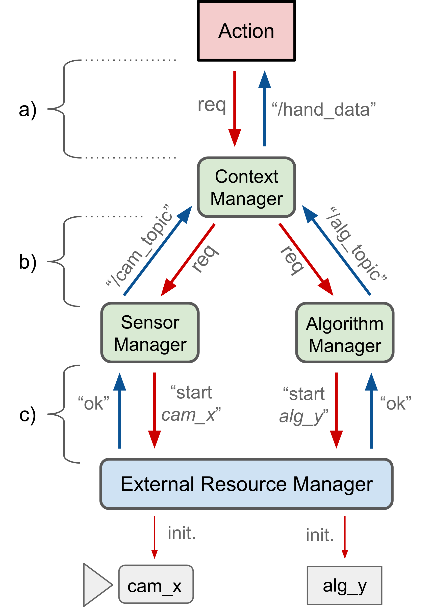

  

# Conceptual Overview

 

In order to get a good overview of how TeMoto works, the 3 key concepts that make up the *architecture* of TeMoto are introduced: *resources*, *actions* and *mangers*.

## Resources
*resource* is regarded as something that is *provided upon a request*. For example, sensors and algorithms are resources for acquiring and manipulating data respectively. Output systems such as speakers or manipulators are resources for interacting with the environment and information about physical objects in the surrounding environmentis viewed as a resource. TeMoto helps to organize the resources which eventually helps to utilize them with minimal effort. 

 

## Actions

The core functionality of TeMoto is to ground instructions in Natural Language (NL) to executable actions, i.e.,modular pieces of code that allow:
* integrating any available hardware and software resources, e.g., sensors, manipulators, object recognition algorithms;
* executing any user specific code with no restrictions to the use of third-party software libraries.

Fig. 3 illustrates the process of grounding NL instructions into actions. The the NL utterance is parsed, e.g., “track the hand and show it on the screen” (Fig. 3a), and every recognized instruction is mapped to an action, thus forming an action tree. The action tree is then executed, starting from the root node of the tree (Fig. 3b). Note that the tree could also contain parallel branches. The actions access system resources through the manager interfaces (Fig. 3c).

  
   
  <b> Fig. 3: </b> Overview of NL grounding in TeMoto via actions. 

 

## Managers

Managers are a set of subsystems in TeMoto that manage the resources. Since the definition for a resource is quite broad (deliberately), resources can be combined to form new resources. For example a resource, such as information about todays weather, can be acquired by combining subresources like humidity and temperature sensors and weather recognition algorithms. Each manager manages a specific domain of resources, including maintaining knowledge about resource:
* availability
* status
* users/clients

Fig. 2 illustrates the main common function of the managers through an example of providing information about hand pose to an action. 

  
   
  <b> Fig. 2: </b> Illustration of the main funtionality of the managers. 

When the action requires the position of operator’s right hand (Fig. 2a), it does not know that the resource (hand position) may have actually been acquired by combining two sub-resources (Fig. 2b) – a camera and an algorithm that extracts information about hands from the camera feed. If any of the sub-resources fail, the action (and all mediating subsystems) must be notified about the event (resource status update) to make appropriate rearrangements.
Whereas Fig. 2 illustrates only one specific example, in general all of the following could be true about a resource:
* The same resource could have been requested by different actions.
* The same action could request different resources.
* A resource could hierarchically depend on multiple layers of sub-resources.

Hence the managers are there to organize, provide and keep an eye on resources.

 

## All together - The Architecture

Now with the previous 3 concepts in mind, the architecture of TeMoto (Fig. 3) can be viewed as a structure of three hierarchical abstract layers and subsystems within:

<!-- SUPERVISORY LAYER -->

  
 
    Supervisory Layer  
    <a href="/temoto-telerobotics.github.io/site/layers/supervisory_layer" style="float: right;">detailed overview</a> 
  

  <blockquote>
    

      The the top level layer that handles the interaction with the human operator and directs the rest of the system.
    

    <b>Subsystems in this layer:</b>
    

      
<a href="/temoto-telerobotics.github.io/site/managers/agent">Agent</a>

      <blockquote>
        The Agent is the core subsystem of TeMoto 2.0, acting as an interface for the operator. It grounds the instructions 
        in Natural Language (NL) into machine executable format which is subsequently executed.  
      </blockquote>
    

    

      
<a href="/temoto-telerobotics.github.io/site/managers/health_monitor">Health Monitor</a>

      <blockquote>
        The Health Monitor is a subsystem that gathers information about the use of resources and the state of other subsystems.  
      </blockquote>
    

    
  </blockquote>
   

<!-- MANAGEMENT LAYER -->

  
 
    Management Layer  
    <a href="/temoto-telerobotics.github.io/site/layers/management_layer" style="float: right;">detailed overview</a> 
  

  <blockquote>
    

      This layer is responsible for acquiring and managing resources via respective manager subsystems.
    

    <b>Subsystems in this layer:</b>
    

      
<a href="/temoto-telerobotics.github.io/site/managers/context_manager">Context Manager</a>

      <blockquote>
        The Context Manager is responsible of perceiving the environment through a combination of sensors and data processing algorithms.
      </blockquote>
    

    

      
<a href="/temoto-telerobotics.github.io/site/managers/robot_manager">Robot Manager</a>

      <blockquote>
        The Robot Manager maintains knowledge about robotic devices including manipulators, grippers, and mobile bases. 
        A single device or an assembly (physical or virtual) of the aforementioned devices compose a robot which is viewed as a resource. 
      </blockquote>
    

    

      
<a href="/temoto-telerobotics.github.io/site/managers/sensor_manager">Sensor Manager</a>

      <blockquote>
        The Sensor Manager maintains knowledge (sensor descriptions) about different types of sensors and directs the data flow of a requested device.  
      </blockquote>
    

    

      
<a href="/temoto-telerobotics.github.io/site/managers/algorithm_manager">Algorithm Manager</a>

      <blockquote>
        The Algorithm Manager maintains knowledge (algorithm descriptions) about different types of algorithms and directs the data flow of a requested algorithm.  
      </blockquote>
    

    

      
<a href="/temoto-telerobotics.github.io/site/managers/output_manager">Output Manager</a>

      <blockquote>
        The Output Manager provides the functionality to output audio-visual data. Similarly to the Sensor Manager, 
        the Output Manager maintains descriptions about different types of output methods and how to access them.  
      </blockquote>
    

  </blockquote>
   

<!-- RESOURCE ACCESS LAYER -->

  
 
    Resource Access Layer  
    <a href="/temoto-telerobotics.github.io/site/layers/resource_access_layer" style="float: right;">detailed overview</a> 
  

  <blockquote>
    

      This layer allows the management layer to access resources that are external to TeMoto, e.g., sensors, actuators.
    
    

    <b>Subsystems in this layer:</b>
    

      
<a href="/temoto-telerobotics.github.io/site/managers/external_resource_manager">External Resource Manager</a>

      <blockquote>
        The role of the Resource Manager is to initiate external resources, via ROS nodes and launch files, upon a request. 
        The Resource Manager is primarily used by the Management layer for initiating sensors, data processing algorithms, 
        robotic devices, and other resources that are not built in TeMoto 2.0. Resource Manager periodically monitors the 
        status of initialized resources and notifies the upper layers about unexpected events.  
      </blockquote>
    
    

  </blockquote>

 

  
   
  <b> Fig. 3: </b> Architecture of TeMoto. 

The term abstraction layer emphasizes the idea that a client of a given resource is oblivious to its origins.

 

